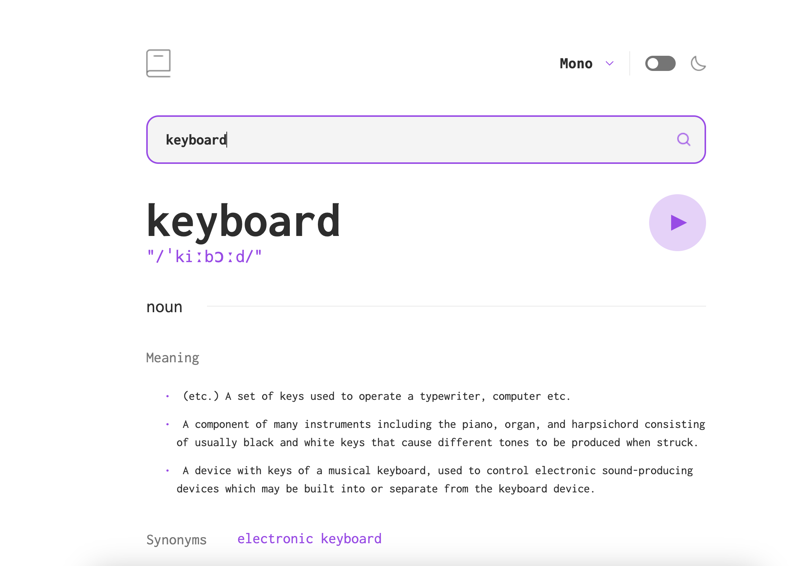

# Frontend Mentor - Dictionary web app solution

This is a solution to the [Dictionary web app challenge on Frontend Mentor](https://www.frontendmentor.io/challenges/dictionary-web-app-h5wwnyuKFL). Frontend Mentor challenges help you improve your coding skills by building realistic projects. 

## Table of contents

- [Overview](#overview)
  - [The challenge](#the-challenge)
  - [Screenshot](#screenshot)
  - [Links](#links)
- [Getting started](#getting-started)  
  - [Installation](#installation)
- [My process](#my-process)
  - [Built with](#built-with)
- [Author](#author)

## Overview

### The challenge

Users should be able to:

- Search for words using the input field
- See the Free Dictionary API's response for the searched word
- See a form validation message when trying to submit a blank form
- Play the audio file for a word when it's available
- Switch between serif, sans serif, and monospace fonts
- Switch between light and dark themes
- View the optimal layout for the interface depending on their device's screen size
- See hover and focus states for all interactive elements on the page
- **Bonus**: Have the correct color scheme chosen for them based on their computer preferences. _Hint_: Research `prefers-color-scheme` in CSS.

### Screenshot



### Links

- Solution URL: [https://github.com/doehna/dictionary-web-app-figma](https://github.com/doehna/dictionary-web-app-figma)
- Live Site URL: [https://doehna.github.io/dictionary-web-app-figma/](https://doehna.github.io/dictionary-web-app-figma/)

## Getting started

To get a local copy up and running follow these simple example steps.

### Installation

- Clone the repo
git clone https://github.com/doehna/calculator-app-main.git

- Install NPM packages
```npm install```

- Start parcel server
```npm start```

## My process

### Built with

- Figma design
- Semantic HTML5 markup
- CSS custom properties
- Flexbox
- JavaScript
- JSON
- API

## Author

- Website - [Dorota Wojdecka](https://github.com/doehna)
- Frontend Mentor - [@doehna](https://www.frontendmentor.io/profile/doehna)